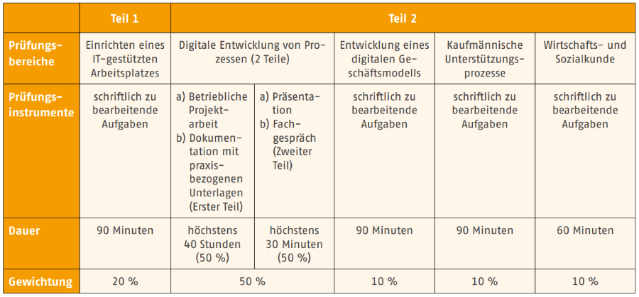
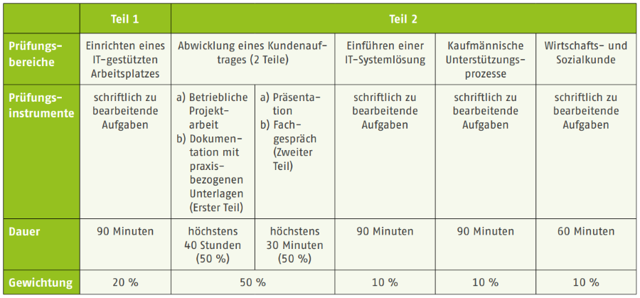

# Aufbau und Inhalt der IHK-Prüfung (AP2)

- Ablauf und Aufbau der AP2
- Bewertung der AP2
- Inhalte

## Ablauf und Aufbau der AP2

Die AP2 ist die erste schriftliche IHK-Prüfung im Rahmen der gestreckten Abschlussprüfung der IT-Berufe. Alle IT-Berufe schreiben eine auf den jeweiligen Beruf spezialisierte AP2. Die Bearbeitungsdauer der schriftlichen Teile beträgt 2 x 90 Minuten (PB1 & PB2) sowie 1 x 60 Minuten (PB3).

Die Prüfungsteile PB1 und PB2 sind in Form von ungebundenen Aufgaben gestellt; also offene Fragen auf die Antwortsätze geschrieben oder Ergebnisse unter Angabe eines Rechenwegs ermittelt werden müssen. Lediglich der WISO-Teil (PB3) besteht aus Multiple-Choice- und Berechnungsaufgaben.

Die Ausbildungsbetriebe melden ihre Auszubildenden für die AP2 bei der IHK an. Die Auszubildenden erhalten über den Betrieb eine Einladung zur Prüfung, welcher der Ort, die Zeit und weitere Details zu entnehmen sind.

Die genauen Termine der AP2 veröffentlicht die IHK Hannover unter folgenden Link:

[IHK Hannover: Termine der AP2](https://www.ihk.de/hannover/hauptnavigation/ausbildung-und-weiterbildung/pruefungen-und-unterrichtungen/ausbildungspruefungen2/pruefungstermine/termine-fuer-schriftliche-abschlusspruefungen-in-kfm-berufen-5195070)

## Bewertung der AP2

Die Bewertung der schriftlichen Teile der AP2 erfolgt bei allen IT-Berufen mit 30% der IHK-Gesamtnote. Für die KDM sind die Prüfungsteile hier dargestellt:

*Bildquelle: BIBB Ausbildung gestalten - Kaufleute für Digitalisierungsmanagement (2020): S. , [LINK](https://www.bibb.de/dienst/publikationen/en/download/16667)*

Die Bewertung der schriftlichen Teile der AP2 erfolgt bei allen IT-Berufen mit 30% der IHK-Gesamtnote. Für die KDM sind die Prüfungsteile hier dargestellt:

*Bildquelle: BIBB Ausbildung gestalten - Kaufleute für IT-System-Management (2020): S. , [LINK](https://www.bibb.de/dienst/publikationen/de/download/16670)*

Die bisherigen Prüfungsergebnisse vergangener Prüfungen können unter folgendem Link in der Prüfungsstatistik der IHK abgerufen werden:

[Prüfungsstatistik der Industrie- und Handelskammer](https://pes.ihk.de/)

## Prüfungskatalog zur AP2

Dem Prüfungskatalog der IHK kann entnommen werden, welche Themen für die Prüfungsteile zugelassen sind. Der gesamten Prüfungskatalog ist über den u-Form-Verlag bestellbar.

[u-Form-Verlag: Prüfungskatalog KDM](https://www.u-form-shop.de/abschlusspruefung/kaufmann-kauffrau-fuer-digitalisierungsmanagement/abschlusspruefung-teil-1/kaufleute-fuer-digitalisierungsmanagement-pruefungskatalog-fuer-die-ihk-abschlusspruefung-neuordnung)

[u-Form-Verlag: Prüfungskatalog KSM](https://www.u-form-shop.de/abschlusspruefung/kaufmann-kauffrau-fuer-it-system-management/abschlusspruefung-teil-1/kaufmann-frau-fuer-it-system-management-pruefungskatalog-fuer-die-ihk-abschlusspruefung-neuordnung)

