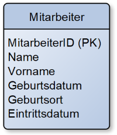

# KDM Digitalisierungsmanagement

## Probeprüfung Nr. 1 (KDM AP2 PB1)

*In Anlehnung an die IHK AP2 S24*

### Handlungssituation

Die DairyTech GmbH ist ein IT-Dienstleister mit etwa 40 Mitarbeitenden. Die Zielgruppe des Unternehmens umfasst Molkereien und andere Unternehmen der Milchprodukte-Industrie im deutschsprachigen Raum.

In den vergangenen Jahren hat sich DairyTech vom klassischen IT-Service hin zu einem Managed Service Provider entwickelt. Dabei betreibt DairyTech IT-Infrastrukturen für Molkereien, die auf eigenen Ressourcen in Rechenzentren in Deutschland basieren. Außerdem werden IT-Dienstleistungen rund um die Produktion, Logistik und Qualitätssicherung von Milchprodukten angeboten.

Einige Kunden aus der Lebensmittelindustrie haben hohe Anforderungen an die IT-Sicherheit und den Datenschutz. DairyTech unterstützt diese Unternehmen dabei, ihre IT-Systeme an die aktuellen Vorschriften anzupassen, z.B. in Bezug auf die Einhaltung der EU-DSGVO.

Um die Sicherheit und Verfügbarkeit der IT-Infrastruktur zu gewährleisten, soll ein Kundenportal entwickelt werden, das den Zugang zu den IT-Diensten erleichtert und gleichzeitig alle relevanten Sicherheitsanforderungen erfüllt.

### 1. Aufgabe (22 Punkte)

#### Aufgabenteil a (6 Punkte)

Das Projekt zur Bereitstellung von Datacenter-Infrastrukturen für Molkereien ist das komplexe Kerngeschäft der DairyTech. Erläutern Sie zwei Aufgaben, die während der Bereitstellung einer Datacenter-Infrastruktur anfallen.

#### Aufgabenteil b (3 Punkte)

Sie haben potenzielle Kunden aus der Milchprodukte-Industrie zu einem eintägigen Workshop zur Bereitstellung der Datacenter-Infrastruktur eingeladen. Ergänzen Sie in der vorliegenden Agenda drei Themen, die Sie während des Workshops behandeln möchten.

- Top 1: Begrüßung
- Top 2:
- Top 3:
- Top 4:
- Top 5: Verabschiedung

#### Aufgabenteil c (4 Punkte)

Beschreiben Sie zwei Ziele, die Sie mit diesem Veranstaltungsformat mit Blick auf die Kundenakquirierung erreichen möchten.

#### Aufgabenteil d (9 Punkte)

Für den Ausbau der Datacenter-Infrastruktur und die Umsetzung der Kundenvorgaben verschiedener Molkereien sind Anforderungen zu berücksichtigen. Im Projektverlauf werden daher verschiedene Dokumente genutzt. Beschreiben Sie diese Artefakte jeweils:

- Anforderungskatalog
- Lastenheft
- Pflichtenheft

### 2. Aufgabe (23 Punkte)

#### Aufgabenteil a (12 Punkte)

Im Rahmen der Erneuerung der Datacenter-Infrastruktur sollen auch die Sicherheitsmaßnahmen in den Produktionshallen der Molkereien überprüft werden. Im Sinne des Edge-Computings sind viele Server dezentral in der Produktion verteilt. Ergänzen Sie die folgende Tabelle um drei Technisch-Organisatorische Maßnahmen (TOMs) und erläutern Sie deren Umsetzung.

#### Aufgabenteil b

Die Geschäftsführung der DairyTech GmbH überlegt, das Rechenzentrum vollständig in die Cloud auszulagern.

#### Aufgabenteil ba (4 Punkte)

Beschreiben Sie zwei Cloud-Services (XaaS).

#### Aufgabenteil bb (3 Punkte)

Erläutern Sie, welches Cloud-Liefermodell Sie der Geschäftsführung in Bezug auf die Kunden aus der Lebensmittelindustrie empfehlen würden.

#### Aufgabenteil c (4 Punkte)

Ein Kunde hat bei der Geschäftsführung nachgefragt, ob die IT-Dienstleistungen der DairyTech GmbH nach ITIL-Kriterien organisiert sind. Beschreiben Sie zwei Grundlagen von ITIL, die in diesem Zusammenhang relevant sind.

### 3. Aufgabe (30 Punkte)

Ein Molkereibetrieb, Kunde der DairyTech GmbH, hat einen IT-Sicherheitsvorfall gemeldet. Durch einen Cyber-Angriff wurden sensible Produktionsdaten verschlüsselt. Dadurch musste das IT-System abgeschaltet werden, und die Molkerei konnte vorübergehend nicht produzieren.

#### Aufgabenteil a (6 Punkte)

Unterscheiden Sie Datenschutz und Datensicherheit. Nehmen Sie dabei Bezug auf die jeweils betroffenen Daten sowie die angestrebten Primärziele.

#### Aufgabenteil b (4 Punkte)

Firewall und Antivirensoftware sind bereits im Einsatz. Beschreiben Sie zwei weitere Möglichkeiten, wie IT-Systeme vor Cyber-Angriffen geschützt werden können.

#### Aufgabenteil c (6 Punkte)

Die Molkerei möchte sich für die Zukunft besser aufstellen und hat beschlossen, ihre Datacenter-Infrastruktur an DairyTech auszulagern. Ein entscheidender Faktor in der Abwägung, der für DairyTech spricht, ist das Ziel der Hochverfügbarkeit. Erläutern Sie zwei Anforderungen, die die Datacenter-Infrastruktur von DairyTech erfüllen muss, um den Anforderungen der Molkerei gerecht zu werden.

#### Aufgabenteil d (9 Punkte)

Die IT-Sicherheit soll durch die Vergabe von Zugriffsrechten erhöht werden. Erstellen Sie ein Datenbankschema, das die Anforderungen an die Zugriffsrechte und deren Dokumentation erfüllt.

Es wird zwischen *Lesen* der Daten sowie *Lesen und Ändern* der Daten unterschieden. Außerdem können beide Berechtigungen nochmals für die Sicherheitsstufen 1 und 2 unterschieden werden. Es gibt also Mitarbeiter, die bspw. in der Sicherheitsstufe 1 nur lesen dürfen, in der Sicherheitsstufe 2 jedoch die Berechtigung Lesen und Ändern besitzen. Weitere Stufen und Berechtigungen sind in Planung.

Es muss für die lückenlose Protokollierung dokumentiert werden, welcher Mitarbeiter zu welchem Zeitpunkt eine Berechtigung hatte. Dazu sollen Beginn und Ende der Rechtevergabe gespeichert werden.

In einer Datenbank exisitert bereits folgende Mitarbeiter-Tabelle:

Erweitern Sie die Datenbank, sodass das Berechtigungsmanagement integiert wird. Ergänzen Sie die Kardinalitäten sowie Primär- und Fremdschlüssel.

#### Aufgabenteil ea (2 Punkte)

Für den Mitarbeiter Thomas Maier mit der MitarbeiterID 101, wurde der Geburtsort falsch im System eingetragen. Erstellen Sie einen SQL-Befehl, mit dem der Geburtsort des Mitarbeiters auf "Hannover" korrigiert werden kann.

#### Aufgabenteil eb (3 Punkte)

Eine neue Mitarbeiterin wird am 01.07.2024 neu eingestellt. Ihr Name ist Lena Müller (geb. 26.08.1999 in Lehrte). Die zugewiesene MitarbeiterID wird die 156. Erstellen Sie die SQL-Anweisung zur Eintragung der neuen Mitarbeiterin.

### 4. Aufgabe (25 Punkte)

Die DairyTech GmbH fokussiert die Digitalisierung ihres Geschäftsmodells durch die Entwicklung eines Portals. Über das Portal sollen die Kunden aus der Molkereibranche ihre IT-Dienste steuern, ihre Bestellungen verwalten und ihre Daten überwachen können.

#### Aufgabenteil a (4 Punkte)

Beschreiben Sie das Problem von Medienbrüchen unter Berücksichtigung der beiden Aspekte "Mitarbeitermotivation" und "Verfügbarkeit der Daten"

#### Aufgabenteil b

Einige Mitarbeitende stehen dem neuen Portal kritisch gegenüber.

#### Aufgabenteil ba (4 Punkte)

Beschreiben Sie den Unterschied zwischen der herkömmlichen Entwicklung eines Geschäftsmodells und der Entwicklung eines digitalen Geschäftsmodells. Nehmen Sie Bezug auf ein selbstgewähltes Beispiel.

#### Aufgabenteil bb (9 Punkte)

Beschreiben Sie drei Vorteile der Digitalisierung des Geschäftsmodells gegenüber analogen Modellen.

#### Aufgabenteil c

Die bisher genutzte Software hatte oft Probleme. Daher soll das DairyTech-Portal als Web-App entwickelt werden, basierend auf dem MVP-Ansatz.

#### Aufgabenteil ca (4 Punkte)

Beschreiben Sie, was ein MVP ist und wie der Nutzen für den Kunden im Laufe der Zeit gesteigert wird.

#### Aufgabenteil cb (4 Punkte)

Erläutern Sie zwei Vorteile einer Web-App im Vergleich zu nativen Apps.

