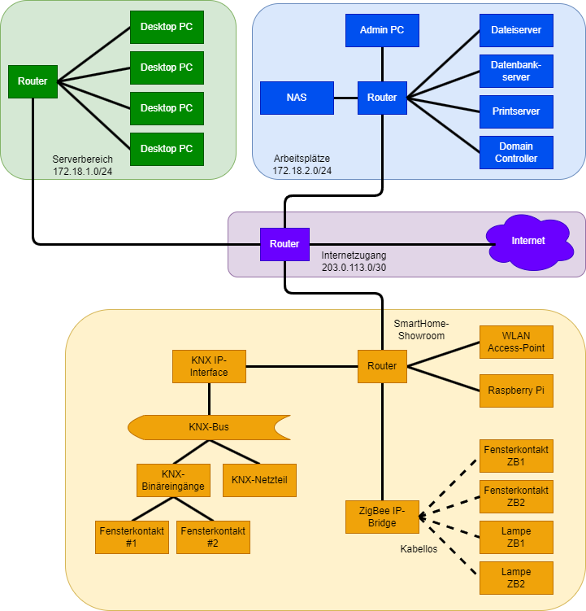

# KSM IT-Systemmanagement

## Probeprüfung Nr. 1 (KSM AP2 PB1)

*In Anlehnung an die IHK AP2 S24*

### Handlungssituation

Die TechHome Solutions GmbH & Co. KG ist ein IT-Systemhaus mit dem besonderen Fokus auf kleine und mittelständische Unternehmen und deren Herausforderungen. Das Produktprogramm wurde über die vergangenen Jahre kontinuierlich erweitert. Aufgrund einiger Kundenanfragen sollen nun die Bereiche Energiemanagement und Gebäudesicherheit mit aufgenommen werden. Sie sollen diese Erweiterung vorbereiten.

### 1. Aufgabe (24 Punkte)

Durch die Energiekostenschwankungen der vergangenen Jahre und weiter sinkende Kosten bei den Komponenten sind intelligente Gebäudeautomatisierungslösungen stärker in den Fokus von Unternehmen und Privathaushalten gerückt. 

#### Aufgabenteil a (4 Punkte)

Beschreiben Sie bei zwei der nachfolgend aufgeführten Geräte das Energieeinsparpotenzial für ein modernes Gebäude.

1. Smarte Thermostate
2. Intelligente Beleuchtungssysteme
3. Energiemanagement-Sensoren
4. Gebäude-Überwachungssoftware

#### Aufgabenteil b (4 Punkte)

In der Gebäudeautomatisierung werden oft drahtlose Verbindungen (WLAN) eingesetzt - insbesondere dann, wenn Lösungen nachgerüstet werden. Nennen Sie je zwei Vorteile und zwei Nachteile von drahtlosen Datenübertragungen (WLAN) gegenüber kabelgebundenen Verbindungen.

#### Aufgabenteil c

Um die Konnektivität aller Geräte in einem Gebäude zu gewährleisten, wird ein Mesh-Netzwerk eingesetzt. Ihnen liegt zu diesem Thema der folgende Informationstext vor, auf dessen Basis Sie die folgenden Fragestellungen beantworten sollen.

*A mesh WLAN is a wide-area network in which multiple access points connect wirelessly to ensure continuous WLAN coverage, even without each access point being connected to the LAN. These access points work together as nodes, forwarding data packets to other nodes, forming what is known as a mesh WLAN.*

*The term "seamless roaming" refers to the automatic and uninterrupted transition of the client’s connection between mesh WLAN cells, ensuring session continuity for the user.*

*In the IEEE 802.11 WLAN standard, access points are referred to as “nodes” in the mesh system. A true mesh network requires at least two paths between nodes, which means the smallest mesh network consists of at least three access points.*

*Mesh WiFi components use a tri-band system, with node connections operating over a high channel in the 5 GHz frequency range. Data transmission for WLAN clients occurs via the 2.4 GHz band and a lower channel in the 5 GHz range.*

#### Aufgabenteil ca (3 Punkte)

Erklären Sie kurz, wie ein Mesh-Netzwerk funktioniert.

#### Aufgabenteil cb (2 Punkte)

Beschreiben Sie, wie ein unterbrechungsfreier Übergang zwischen den Funkzellen für die Endgeräte erreicht wird.

#### Aufgabenteil cc (2 Punkte)

Erläutern Sie, warum für ein Mesh-Netzwerk mindestens drei Zugangspunkte erforderlich sind.

#### Aufgabenteil cd (3 Punkte)

Beschreiben Sie, wie verschiedene Frequenzbänder zur Realisierung eines stabilen Mesh-Netzwerks eingesetzt werden.

#### Aufgabenteil ce (4 Punkte)

Erläutern Sie den Begriff „Mesh-Steering" und wie dieser Ansatz die Stabilität des Netzwerks verbessert.

#### Aufgabenteil cf (2 Punkte)

Erklären Sie, ob Komponenten verschiedener Hersteller im Mesh-Netzwerk miteinander kompatibel sind.

### 2. Aufgabe (26 Punkte)

Die TechHome Solutions AG hat einen Showroom eingerichtet, um Kunden die neuen Gebäudeautomatisierungssysteme vorzustellen. In einem abgetrennten Bereich werden smarte Geräte sowohl mit kabelgebundenen KNX- als auch kabellosen ZigBee-Protokollen präsentiert. Die Firma nutzt das Klasse-B-Netzwerk 172.18.0.0 und hat für verschiedene Bereiche eigene Subnetze angelegt. Ihre Aufgabe ist es, für die neuen Geräte passende IP-Adressen zu vergeben und die Netzwerkstruktur im Showroom optimal zu organisieren.

#### Aufgabenteil a (5 Punkte)

Für den neuen Showroom-Bereich soll ein eigenes Subnetz innerhalb des vorhandenen Klasse-B-Netzwerks eingerichtet werden. Erstellen Sie ein separates Subnetz und weisen Sie den vier Geräten im Showroom jeweils eine passende IP-Adresse und Subnetzmaske zu.

- Subnetz in CIDR-Schreibweise für den Showroom
- IP-Adresse und Subnetzmaske für ...
  - WLAN Access-Point
  - Raspberry Pi
  - ZigBee IP-Bridge
  - KNX IP-Interface

#### Aufgabenteil b (2 Punkte)

Um die drahtlosen ZigBee-Geräte in das Netzwerk zu integrieren, wird das OSI-7-Schichten-Modell als Grundlage verwendet. ZigBee baut wie Bluetooth auf dem IEEE-Standard 802.15.4 auf, der die unteren beiden OSI-Schichten abdeckt.

Ergänzen Sie in der folgenden Tabelle die Namen der fehlenden OSI-Schichten, um das OSI-Modell vollständig darzustellen.

| Schicht | Name |
| :---: | :--- |
| 7 | Anwendungsschicht |
| 6 |  |
| 5 | Sitzungsschicht |
| 4 |  |
| 3 |  |
| 2 | Sicherungsschicht |
| 1 |  |

#### Aufgabenteil c (6 Punkte)

Im Showroom werden verschiedene Arten von Smart-Home-Geräten vorgestellt, die zur Steuerung und Überwachung der Umgebung beitragen. Diese Geräte lassen sich in zwei Hauptkategorien einteilen: Sensoren und Aktoren.

Beschreiben Sie die grundlegende Funktion von Sensoren und Aktoren und nennen Sie jeweils ein Beispiel.

#### Aufgabenteil d (4 Punkte)

Im Showroom sind unterschiedliche Netzwerktopologien dargestellt: Der KNX-Bereich nutzt eine Bus-Topologie, während ZigBee-Geräte in einer Sternstruktur organisiert sind.

Beschreiben Sie die Eigenschaften der Bus- und der Stern-Topologie. Geben Sie jeweils ein weiteres Beispiel neben KNX und ZigBee an.

#### Aufgabenteil e

#### Aufgabenteil ea (6 Punkte)

Als Nachteil der Nutzung von Smart-Home-Komponenten wird in der Regel der zusätzliche Energiebedarf angegeben. Hierbei gilt es also den Trade-Off zwischen Funktion und weiteren Kosten abzuwägen. Um im Showroom entsprechend argumentativ gerüstet zu sein, bereiten Sie eine Beispielrechnung vor.

Berechnen Sie bei einem Strompreis von 28 Cent je Kilowattstunde und bei einem Preis von 0,55 EUR je AAA-Batterie die Energiekosten für den KNX-Einsatz auf der einen und den ZigBee-Einsatz auf der anderen Seite.

| Gerät | Anzahl | Leistung | Betriebsdauer |
| :--- | :---: | ---: | :--- |
| KNX-BUS Netzteil | 1 | 1,4 Watt | 24h / 365 Tage |
| KNX-BUS IP-Interface | 1 | 0,9 Watt | 24h / 365 Tage |
| KNX-BUS Binäreingang (8-fach) | 1 | 0,3 Watt | 24h / 365 Tage |
| ZigBee Bridge | 1 | 4 Watt | 24h / 365 Tage |
| ZigBee Tür-/Fenster-Kontakt | 8 | 1x AAA-Batterie/pa | 365 Tage |

Berechnen Sie den jährlich anfallenden Strombedarf in Kilowattstunden und die jährlichen Kosten je System.

#### Aufgabenteil eb (3 Punkte)

Über die Energiekosten hinaus gibt es weitere Aspekte, die Kunden bei der Auswahl von Smart-Home-Systemen berücksichtigen sollten. Überlegen Sie, welche Kombination aus Geräten Sie dem Kunden vorschlagen würden und begründen Sie den jeweiligen Vorschlag.

### 3. Aufgabe (Punkte)

Die TechHome Solutions AG hat bisher nur einige wenige Geräte im Bereich der Gebäudeautomatisierung im Portfolio. Da die Geschäftsführung in diesem Marktsegment großes Potenzial sieht, soll das Angebot gezielt um Produkte zur Energieoptimierung und Sicherheit erweitert werden.

#### Aufgabenteil a (3 Punkte)

Um die Strategie für die Erweiterung festzulegen, hat die Geschäftsführung eine Marktanalyse durchgeführt und die neue Produktgruppe in die Kategorie "Question Marks" der BCG-Matrix eingeordnet. Die Kategorisierung erfolgt auch mit dem Blick auf das Auftreten eines neuen Standards mit dem Namen "Matter".

Benennen Sie die drei anderen Felder der BCG-Matrix und deren Bezeichnungen in Deutsch oder Englisch.

#### Aufgabenteil b (3 Punkte)

Erläutern Sie, warum diese Einstufung als "Question Marks" erfolgt ist und welche typischen Eigenschaften Produkte in dieser Kategorie aufweisen.

#### Aufgabenteil c (4 Punkte)

Die Geschäftsführung beauftragt Sie, eine geeignete Marketingstrategie zu entwickeln, um die neue Produktgruppe erfolgreich am Markt zu positionieren.

Beschreiben Sie zwei geeignete Marketingstrategien, die für "Question Marks"-Produkte sinnvoll sind, und erläutern Sie, warum diese Strategien für die Marktentwicklung geeignet sein könnten.

#### Aufgabenteil d (3 Punkte)

Die TechHome Solutions AG plant, zur Unterstützung der Markteinführung der neuen Produktgruppe ein CRM (Customer Relationship Management) System einzuführen.

Erklären Sie, wie der Einsatz eines CRM-Systems die Einführung der neuen Smart-Home-Produkte unterstützen kann und welche Vorteile dies im Kundenkontakt mit sich bringt.

#### Aufgabenteil e (4 Punkte)

Zur Umsatzsteigerung möchte die TechHome Solutions AG ihr Portfolio erweitern, z.B. durch die Einführung von neuen ins Netzwerk eingebundenen Lichtsteuerungssystemen und Produkten mit erweiterten Funktionen.

Beschreiben Sie die beiden Verkaufsstrategien Cross-Selling und Up-Selling und erläutern Sie anhand der geplanten Portfolioerweiterung, wie diese Strategien eingesetzt werden könnten.

#### Aufgabenteil f (3 Punkte)

Um die neuen Smart-Home-Produkte besser zu vermarkten, soll die Website der TechHome Solutions AG angepasst werden.

Nennen Sie drei Maßnahmen, die die Einführung der neuen Produkte auf der Website unterstützen und die Kunden gezielt ansprechen könnten.

#### Aufgabenteil g (4 Punkte)

Die TechHome Solutions AG plant, den Verkauf ihrer Smart-Home-Produkte durch zusätzliche Vertriebskanäle zu steigern.

Schlagen Sie zwei mögliche Absatzwege vor, die zur Steigerung der Verkaufszahlen beitragen könnten, und begründen Sie Ihre Vorschläge.

### 4. Aufgabe (26 Punkte)

#### Aufgabenteil a

Die TechHome Solutions AG überlegt, für die Beschaffung der neuen Produkte entweder eine direkte oder indirekte Beschaffung zu wählen.

#### Aufgabenteil aa (4 Punkte)

Erläutern Sie, was unter direkter und indirekter Beschaffung verstanden wird.

#### Aufgabenteil ab (2 Punkte)

Nennen Sie zwei Vorteile der direkten oder indirekten Beschaffung für die TechHome Solutions AG und begründen Sie Ihre Wahl kurz.

#### Aufgabenteil ac (4 Punkte)

Eine zusätzliche Beschaffungsoption wäre die Nutzung von B2B-Marktplätzen, auf denen Unternehmen Produkte und Dienstleistungen handeln können. Erklären Sie den Begriff B2B-Marktplatz und nennen Sie einen Vorteil dieser Beschaffungsmethode für die TechHome Solutions AG.

#### Aufgabenteil b

Da die TechHome Solutions AG ihre Lagerhaltung möglichst klein halten möchte, sollen die neuen Produkte in verschiedenen Varianten angeboten werden, wie z.B. als Basis- und Erweiterungspakete.

#### Aufgabenteil ba (2 Punkte)

Beschreiben Sie einen Vorteil der Digitalisierung für die Beschaffung und wie diese das Bestandsmanagement optimieren kann.

#### Aufgabenteil bb (6 Punkte)

Erklären Sie die Unterschiede zwischen auftragsbezogener und vorratsbezogener Beschaffung und geben Sie eine Empfehlung, welche Methode für das Basispaket der TechHome Solutions AG am besten geeignet ist. Begründen Sie Ihre Empfehlung.

#### Aufgabenteil bc (6 Punkte)

Im modernen Beschaffungsmanagement werden verschiedene Sourcing-Strategien unterschieden, um die Versorgungssicherheit und die Kostenoptimierung zu gewährleisten.

Beschreiben Sie die folgenden Sourcing-Strategien kurz und geben Sie jeweils ein Beispiel:

- Single-Sourcing
- Multi-Sourcing
- Local-Sourcing
- Preferential-Sourcing

#### Aufgabenteil bd (2 Punkte)

Die TechHome Solutions AG plant, ihre Beschaffungsprozesse so weit wie möglich zu digitalisieren. Nennen Sie zwei Technologien, die das digitale Beschaffungswesen unterstützen und erklären Sie kurz deren Nutzen für die TechHome Solutions AG.

