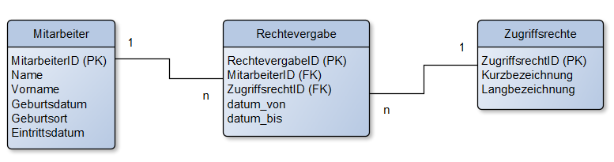

# Lösungshinweise zu KDM Digitalisierungsmanagement

## Probeprüfung Nr. 1 (KDM AP2 PB1)

### 1. Aufgabe (22 Punkte)

#### Aufgabenteil a (6 Punkte)

- **Installation und Konfiguration der Hardware:** Dazu gehört das Einrichten von Servern, Netzwerkgeräten und Speichersystemen sowie die physische Verkabelung.
- **Netzwerksicherheit gewährleisten:** Dies umfasst die Implementierung von Firewalls, VPNs und Verschlüsselungsprotokollen, um die IT-Infrastruktur gegen unbefugten Zugriff abzusichern.
- **Softwareinstallation und Systemintegration:** Installation der Betriebssoftware und anderer für den Betrieb der IT-Infrastruktur notwendiger Anwendungen.
- **Redundanz und Ausfallsicherheit:** Einrichtung redundanter Systeme, um bei einem Ausfall der Hauptkomponenten den Betrieb aufrechtzuerhalten.
- **Datensicherung:** Implementierung von Backup- und Recovery-Systemen zur Sicherstellung der Datenintegrität.
- **Trainingskonzept entwickeln:** Durchführung von Schulungen mit dem Kunden.

#### Aufgabenteil b (3 Punkte)

- **Zeitlicher Ablauf des Projekts:** Eine Übersicht des geplanten Zeitrahmens, in dem das Projekt umgesetzt werden soll, inklusive der wichtigsten Meilensteine und Deadlines.
- **Vorstellung der Ansprechpartner und ihrer Rollen:** Eine kurze Vorstellung der involvierten Personen im Projekt, ihre jeweiligen Funktionen und Verantwortlichkeiten innerhalb des Teams.
- **Workshop zu Datenschutz und Datensicherheit:** Eine Schulung oder Besprechung, die sich mit den wichtigen Aspekten des Schutzes von Daten und der Sicherheit in der digitalen Umgebung befasst, um sicherzustellen, dass alle Vorgaben eingehalten werden.
- **Workshop zur Modularität der Anwendungen:** Ein Workshop, der das Konzept der Modularität erklärt und zeigt, wie die verschiedenen Komponenten der Software flexibel eingesetzt und an unterschiedliche Bedürfnisse angepasst werden können.
- **Präsentation der technischen Details der Lösung und der vorhandenen Module:** Eine detaillierte Vorstellung der technischen Struktur der Lösung, einschließlich der verschiedenen bereits entwickelten Module und deren Funktionsweise.
- **Zusammenfassung und Ausblick:** Ein abschließender Überblick über das bisher Erreichte sowie eine Vorschau auf die nächsten Schritte im Projekt.

#### Aufgabenteil c (4 Punkte)

- **Vertrauen aufbauen:** Kunden sollen Vertrauen in die Fähigkeit von DairyTech gewinnen, zuverlässige IT-Dienstleistungen zu erbringen.
- **Lösungsorientiertes Denken fördern:** Den Kunden werden maßgeschneiderte Lösungen für ihre spezifischen IT-Bedürfnisse in der Molkereibranche präsentiert.
- **Beziehungen stärken:** Der Workshop dient dazu, persönliche Beziehungen zu potenziellen Kunden aufzubauen.
- **Kundenzufriedenheit erhöhen:** Die Präsentation konkreter Lösungen zeigt, wie DairyTech Kundenanforderungen erfüllt.
- **Datenschutz und Datensicherheit**: Kunden für den Datenschutz und die Datensicherheit sensibilisieren und Schutzmaßnahmen abstimmen.
- **Anforderungserhebung:** Systematische Erhebung der funktionalen und nichtfunktionalen Anforderungen sowie deren Priorisierung (bspw. MOSCOW-Methode)
- **Abrechnungsmodelle:** Klärung, welche Abrechnungsmodelle für den Kunden in Frage kommen.

#### Aufgabenteil d (9 Punkte)

- **Anforderungskatalog:** Eine Sammlung aller Anforderungen des Kunden, die während des Projekts berücksichtigt werden müssen.
- **Lastenheft:** Dokument, das die Anforderungen des Kunden detailliert beschreibt, inklusive der gewünschten Funktionen und Leistungen.
- **Pflichtenheft:** Enthält die technische Umsetzung der im Lastenheft beschriebenen Anforderungen. Es beschreibt die konkrete Lösung, wie diese Anforderungen erfüllt werden.

### 2. Aufgabe (23 Punkte)

#### Aufgabenteil a (12 Punkte)

- **Zutrittskontrolle:** Maßnahmen, die verhindern, dass unbefugte Personen Zugang zu Anlagen erhalten, in denen personenbezogene Daten verarbeitet werden. Beispiele hierfür sind automatische Zutrittssysteme oder der Einsatz von Chipkarten und Transpondern.
- **Zugangskontrolle:** Maßnahmen, die sicherstellen, dass nur befugte Personen auf Computersysteme zugreifen können. Dies kann durch Boot-Passwörter, Benutzerkennungen mit Passwörtern oder passwortgeschützte Bildschirmschoner erreicht werden.
- **Zugriffskontrolle:** Maßnahmen, die garantieren, dass autorisierte Personen nur auf die Daten zugreifen können, für die sie berechtigt sind. Diese Daten dürfen nicht unbefugt gelesen, kopiert, verändert oder gelöscht werden. Zugriffskontrollsysteme regeln, wer welche Daten nutzen darf.
- **Trennungskontrolle:** Maßnahmen, die sicherstellen, dass Daten, die für unterschiedliche Zwecke erhoben wurden, getrennt voneinander verarbeitet werden. Dies kann sowohl durch physische als auch durch logische Trennung der Daten geschehen.
- **Weitergabekontrolle:** Maßnahmen, die verhindern, dass personenbezogene Daten während der Übertragung oder Speicherung unbefugt eingesehen, kopiert, verändert oder gelöscht werden können. Beispiele dafür sind die E-Mail-Verschlüsselung oder die Nutzung von VPNs.
- **Eingangs- bzw. Eingabekontrolle:** Maßnahmen, die es ermöglichen, nachträglich festzustellen, ob und von wem personenbezogene Daten in ein System eingegeben, verändert oder gelöscht wurden. Dies erfolgt durch Protokollierungen auf verschiedenen Systemebenen, wie Betriebssystem, Netzwerk oder Datenbank.
- **Auftragskontrolle:** Maßnahmen, die sicherstellen, dass personenbezogene Daten, die im Auftrag verarbeitet werden, nur nach den Weisungen des Auftraggebers genutzt werden dürfen.
- **Verfügbarkeitskontrolle:** Maßnahmen, die dafür sorgen, dass personenbezogene Daten gegen zufällige Zerstörung oder Verlust geschützt sind. Dazu gehören unterbrechungsfreie Stromversorgung, Brandschutz, Datensicherungen oder RAID-Systeme.

#### Aufgabenteil b

#### Aufgabenteil ba (4 Punkte)

- **Infrastructure as a Service (IaaS):** Bereitstellung von Rechenkapazität, Speicher und Netzwerkinfrastruktur, die nach Bedarf genutzt werden können.
- **Platform as a Service (PaaS):** Eine Plattform, auf der Kunden ihre eigenen Anwendungen entwickeln, testen und betreiben können, ohne sich um die zugrundeliegende Infrastruktur zu kümmern.
- **Software as a Service (SaaS):** Bereitstellung von Softwareanwendungen über das Internet, die von Kunden genutzt werden können, ohne diese auf ihren eigenen Geräten installieren oder verwalten zu müssen. Beispiele sind Cloud-basierte Anwendungen wie E-Mail-Dienste, CRM-Systeme oder Office-Software.
- **Function as a Service (FaaS):** Ein cloudbasiertes Modell, bei dem Kunden einzelne Funktionen oder Code-Snippets bereitstellen und ausführen können, ohne sich um die Verwaltung von Servern oder Infrastruktur zu kümmern. Der Anbieter übernimmt die gesamte Backend-Verwaltung, während der Kunde nur für die ausgeführten Funktionen zahlt.
- **Desktop as a Service (DaaS):** Bereitstellung von virtuellen Desktops über das Internet. Nutzer können über verschiedene Geräte auf einen cloudbasierten Desktop zugreifen, der von einem externen Anbieter verwaltet wird. Dies ermöglicht eine flexible und ortsunabhängige Nutzung, ohne dass lokale Hardware oder komplexe IT-Infrastruktur erforderlich ist.

#### Aufgabenteil bb (3 Punkte)

**Private Cloud:** Empfohlen wird eine Private Cloud, da diese ein hohes Maß an Kontrolle, Sicherheit und Anpassbarkeit bietet, was insbesondere bei Kunden aus der Lebensmittelindustrie aufgrund strenger Datenschutzvorschriften vorteilhaft ist.

#### Aufgabenteil c (4 Punkte)

- **Service Strategy (Service-Strategie):** Diese Phase konzentriert sich darauf, IT-Dienstleistungen an den Geschäftsanforderungen auszurichten. Es geht darum, den Wert der IT-Dienste für das Unternehmen zu definieren und sicherzustellen, dass die IT eine unterstützende Rolle für die Unternehmensziele spielt. Für DairyTech bedeutet das, dass die IT-Dienstleistungen so geplant werden, dass sie direkt zur Wertschöpfung des Unternehmens beitragen.
- **Service Design (Service-Design):** In dieser Phase werden neue oder geänderte IT-Dienste entworfen. Es wird sichergestellt, dass alle Aspekte eines Services (z. B. Kapazität, Verfügbarkeit, Sicherheit) berücksichtigt werden, bevor er in Betrieb genommen wird. Für DairyTech bedeutet das, dass IT-Services systematisch und methodisch entwickelt werden, um die Bedürfnisse des Unternehmens langfristig zu unterstützen.
- **Service Transition (Service-Übergang):** Diese Phase stellt sicher, dass neue oder geänderte Services sicher und effizient in die Produktivumgebung überführt werden. Dies beinhaltet auch Change Management, um Risiken während der Einführung neuer Dienste zu minimieren.
- **Service Operation (Service-Betrieb):** Hierbei handelt es sich um den laufenden Betrieb der IT-Dienstleistungen. Es wird sichergestellt, dass die Services effektiv und effizient erbracht werden, um die vereinbarten Service-Level-Agreements (SLAs) einzuhalten. Für DairyTech bedeutet dies eine hohe Verfügbarkeit und Zuverlässigkeit der IT-Dienste im Tagesgeschäft.
- **Continual Service Improvement (Kontinuierliche Serviceverbesserung):** Diese Phase zielt darauf ab, die Qualität der IT-Dienstleistungen kontinuierlich zu überprüfen und zu verbessern, basierend auf den sich ändernden Geschäftsanforderungen und neuen Technologien.

### 3. Aufgabe (30 Punkte)

#### Aufgabenteil a (6 Punkte)

| Aspekt | Datenschutz | Datensicherheit |
| :--- | :--- | :--- |
| Betroffene Daten | Personenbezogene Daten | Jegliche Daten, unabhängig von ihrem Inhalt |
| Angestrebtes Primärziel | Schutz der Privatsphäre und personenbezogener Daten | Schutz der Daten vor Verlust, Manipulation und Zugriff |

**Datenschutz** bezieht sich auf den Schutz personenbezogener Daten, also Informationen, die einer natürlichen Person zugeordnet werden können. Das Ziel ist es, die Persönlichkeitsrechte der betroffenen Personen zu wahren. Wichtige rechtliche Grundlagen sind die EU-Datenschutz-Grundverordnung (EU-DSGVO) und das Bundesdatenschutzgesetz (BDSG), die den Schutz der Grundrechte und Freiheiten natürlicher Personen sicherstellen.

**Datensicherheit** ist ein umfassenderes Konzept, das den Schutz aller Arten von Daten abdeckt. Ihr Hauptziel ist es, die Vertraulichkeit, Integrität und Verfügbarkeit der Daten zu gewährleisten. Dabei werden praktische Sicherheitsmaßnahmen wie Datensicherung, technische Schutzmechanismen gegen Datenverlust sowie organisatorische und technische Vorkehrungen getroffen, um Daten zu schützen.

#### Aufgabenteil b (4 Punkte)

- **Intrusion Detection/Prevention Systems (IDS/IPS):** Diese Systeme überwachen den Netzwerkverkehr und identifizieren potenzielle Angriffe. Ein IDS meldet verdächtige Aktivitäten, während ein IPS zusätzlich Maßnahmen ergreifen kann, um Angriffe automatisch zu blockieren.
- **Mehrstufige Authentifizierung (Multi-Factor Authentication, MFA):** Durch die Kombination von mehreren Authentifizierungsmethoden (z. B. Passwort und zusätzlicher Sicherheitscode per SMS oder App) wird der Zugriff auf Systeme erheblich sicherer gemacht, da Angreifer mehrere Hürden überwinden müssen.
- **Verschlüsselung:** Die Verschlüsselung von Daten im Ruhezustand (z. B. auf Festplatten) und während der Übertragung (z. B. über SSL/TLS) sorgt dafür, dass selbst bei einem Datenleck die Informationen unbrauchbar sind, solange der Angreifer nicht den Entschlüsselungsschlüssel besitzt.
- **Patch-Management:** Regelmäßige Updates und Patches für Betriebssysteme und Anwendungen sind essenziell, um Sicherheitslücken zu schließen, die von Angreifern ausgenutzt werden könnten.
- **Zugangskontrollen und Berechtigungsmanagement:** Durch klare Regeln und eingeschränkte Zugriffsrechte wird sichergestellt, dass nur autorisierte Personen auf sensible Daten oder Systeme zugreifen können. Rollenbasierte Zugriffssteuerung (Role-Based Access Control, RBAC) stellt sicher, dass Mitarbeiter nur auf die Ressourcen zugreifen können, die sie zur Ausführung ihrer Aufgaben benötigen.
- **Netzwerksegmentierung:** Durch die Aufteilung eines Netzwerks in kleinere, isolierte Segmente wird der Zugang zu kritischen Bereichen eingeschränkt. Sollte ein Angreifer in ein Segment eindringen, bleibt der Schaden lokal begrenzt.
- **Sicherheitsbewusstseinsschulungen:** Mitarbeiterschulungen sind eine effektive Methode, um Phishing-Angriffe und Social Engineering zu verhindern. Regelmäßige Sensibilisierung für sichere Passwörter, verdächtige E-Mails und den richtigen Umgang mit sensiblen Daten kann viele Sicherheitsvorfälle vermeiden.
- **Backup-Strategien:** Regelmäßige Backups sind ein wichtiger Schutz gegen Datenverlust durch Ransomware oder andere Angriffe. Die Backups sollten sicher aufbewahrt und regelmäßig getestet werden, um im Ernstfall schnell wiederherstellbar zu sein.
- **Penetrationstests:** Regelmäßige Tests der IT-Systeme durch sogenannte "Ethical Hacker" oder Penetrationstester helfen dabei, Schwachstellen aufzudecken, bevor sie von Angreifern ausgenutzt werden können.
- **Security Information and Event Management (SIEM):** Ein SIEM-System sammelt und analysiert sicherheitsrelevante Ereignisse aus verschiedenen Quellen im Netzwerk und ermöglicht eine zentrale Überwachung. Es unterstützt dabei, potenzielle Sicherheitsvorfälle frühzeitig zu erkennen und zu reagieren.

#### Aufgabenteil c (6 Punkte)

- **Redundante Hardware:** Um Ausfallzeiten zu minimieren, muss die IT-Infrastruktur redundant aufgebaut sein. Das betrifft Server, Speicher (Storage), Netzwerkknoten und Stromversorgung. Fällt ein Teil der Infrastruktur aus, übernimmt ein anderes System nahtlos den Betrieb.
- **Load Balancing:** Der Einsatz von Lastverteilungssystemen sorgt dafür, dass die Last auf verschiedene Server verteilt wird, um Überlastungen zu vermeiden und die Verfügbarkeit der Systeme auch bei erhöhtem Datenverkehr zu gewährleisten.
- **Georedundanz:** Für maximale Ausfallsicherheit sollte DairyTech Rechenzentren an mehreren geografischen Standorten betreiben. Im Falle eines katastrophalen Ausfalls an einem Standort kann ein anderer Standort die Dienste übernehmen.
- **Automatisches Failover:** DairyTech muss ein Failover-System implementieren, das im Fall eines Ausfalls eines Systems automatisch auf ein Backup-System umschaltet, ohne dass manuelle Eingriffe erforderlich sind.
- **Schnelle Wiederherstellungszeiten (Recovery Time Objective, RTO):** Die Infrastruktur muss so ausgelegt sein, dass im Falle eines Ausfalls die Wiederherstellungszeit so kurz wie möglich ist, um den Betrieb der Molkerei aufrechtzuerhalten.
- **Hohe Service-Level-Agreements (SLAs):** DairyTech sollte klare und verlässliche SLAs anbieten, die garantieren, dass die Verfügbarkeit der Dienste auf einem hohen Niveau (z. B. 99,99 %) gehalten wird.
- **Netzwerksicherheit:** DairyTech muss umfangreiche Sicherheitsmaßnahmen auf Netzwerkebene implementieren, wie z. B. Firewalls, Intrusion Detection/Prevention Systems (IDS/IPS), und Verschlüsselungstechnologien, um unberechtigte Zugriffe oder Angriffe abzuwehren.
- **Verschlüsselung von Daten:** Alle sensiblen Daten der Molkerei, sowohl im Ruhezustand als auch während der Übertragung, müssen durch starke Verschlüsselung geschützt werden (z. B. AES-256). Dies gilt sowohl für Datenbanken als auch für Datenübertragungen über Netzwerke.
- **Zugangskontrollen:** DairyTech sollte strenge Zugangs- und Berechtigungskonzepte implementieren, um sicherzustellen, dass nur autorisierte Personen Zugriff auf die Systeme und Daten der Molkerei haben. Dazu gehören Multi-Factor Authentication (MFA) und rollenbasierte Zugriffssteuerung (RBAC).
- **Regelmäßige Sicherheitsupdates und Patching:** Die Infrastruktur von DairyTech muss durch ein systematisches Patch-Management immer auf dem neuesten Stand sein, um Sicherheitslücken zu schließen und Angriffe durch Schwachstellen zu verhindern.
- **Datensicherung und Disaster Recovery:** DairyTech muss regelmäßig Backups der Daten erstellen und ein umfassendes Disaster-Recovery-Konzept haben, um sicherzustellen, dass im Falle eines Angriffs oder eines technischen Problems alle Daten sicher wiederhergestellt werden können.
- **Überwachung und Protokollierung:** Es sollte ein Security Information and Event Management (SIEM)-System eingesetzt werden, das sicherheitsrelevante Ereignisse kontinuierlich überwacht und protokolliert. Verdächtige Aktivitäten können so frühzeitig erkannt und schnell Maßnahmen ergriffen werden.
- **Schulung und Sensibilisierung der Mitarbeiter:** Mitarbeiter von DairyTech sollten regelmäßig in IT-Security-Praktiken geschult werden, um Phishing-Angriffe und Social Engineering abzuwehren.
- **Compliance mit Sicherheitsstandards:** DairyTech muss sicherstellen, dass die Rechenzentren nach anerkannten Sicherheitsstandards (z. B. ISO/IEC 27001, BSI IT-Grundschutz) zertifiziert sind und den Anforderungen der DSGVO entsprechen.
- **On-Demand-Skalierbarkeit:** Die Infrastruktur muss flexibel und skalierbar sein, sodass DairyTech der Molkerei bei Bedarf schnell zusätzliche Rechenleistung, Speicher oder Netzwerkressourcen bereitstellen kann.
- **Anpassbare SLAs:** DairyTech sollte in der Lage sein, maßgeschneiderte Service-Level-Agreements anzubieten, die an die spezifischen Anforderungen der Molkerei angepasst werden können.
- **Proaktives Monitoring:** DairyTech sollte ein System für proaktives Monitoring bereitstellen, das es ermöglicht, potenzielle Probleme oder Engpässe frühzeitig zu erkennen und zu beheben, bevor sie die Verfügbarkeit der Systeme beeinträchtigen.
- **Transparente Berichterstattung:** Die Molkerei sollte regelmäßig Berichte über den Status der IT-Systeme, Sicherheitsvorfälle und die Einhaltung von SLAs erhalten, um sicherzustellen, dass DairyTech seinen Verpflichtungen nachkommt.

#### Aufgabenteil d (9 Punkte)



#### Aufgabenteil ea (2 Punkte)

```sql
UPDATE Mitarbeiter 
SET Geburtsort = 'Hannover' 
WHERE MitarbeiterID = 101;
```

#### Aufgabenteil eb (3 Punkte)

```sql
INSERT INTO Mitarbeiter (MitarbeiterID, Name, Vorname, Geburtsdatum, Geburtsort) 
VALUES (156, 'Müller', 'Lena', '1999-08-26', 'Lehrte');
```

### 4. Aufgabe (25 Punkte)

#### Aufgabenteil a (4 Punkte)

- **Mitarbeitermotivation:** Medienbrüche führen zu redundanten Aufgaben, wie dem erneuten Eintippen von Daten, was demotivierend wirkt.
- **Verfügbarkeit der Daten:** Durch Medienbrüche können Daten nicht in Echtzeit abgerufen werden, was die Effizienz behindert.

#### Aufgabenteil b

#### Aufgabenteil ba (4 Punkte)

Beim herkömmlichen Geschäftsmodell sind Prozesse wie die Auftragserfassung und -abwicklung oft papierbasiert. Im digitalen Modell werden diese Prozesse automatisiert und über Plattformen abgewickelt. Beispiel: Kundenbestellungen erfolgen online statt über Papierformulare.

#### Aufgabenteil bb (9 Punkte)

- **Effizienzsteigerung:** Automatisierte Prozesse reduzieren manuelle Eingriffe.
- **Kostenersparnis:** Weniger Papierverbrauch und weniger personelle Ressourcen erforderlich.
- **Verbesserte Kundenerfahrung:** Kunden können rund um die Uhr auf Services zugreifen.
- **Skalierbarkeit:** Digitale Modelle lassen sich leichter auf neue Märkte oder Kundengruppen erweitern.
- **Schnellere Reaktionszeiten:** Änderungen und Anpassungen können in Echtzeit vorgenommen werden.

#### Aufgabenteil c

#### Aufgabenteil ca (4 Punkte)

Ein **Minimum Viable Product (MVP)** ist eine Version eines Produkts mit den minimal notwendigen Funktionen, um erste Kundenfeedbacks zu sammeln und das Produkt schrittweise zu verbessern. Der Kundennutzen wird durch kontinuierliche Erweiterungen und Anpassungen gesteigert.

#### Aufgabenteil cb (4 Punkte)

- **Plattformunabhängigkeit**: Web-Apps laufen in einem Webbrowser und sind daher unabhängig vom Betriebssystem oder Gerätetyp (Windows, macOS, Android, iOS). Dies reduziert den Entwicklungsaufwand, da keine separate App für jede Plattform erstellt werden muss.
- **Einfache Wartung und Updates**: Änderungen und Updates an Web-Apps werden zentral auf dem Server vorgenommen. Benutzer erhalten sofort die neueste Version der App, ohne dass sie manuell Aktualisierungen installieren müssen.
- **Kosteneffizienz**: Da Web-Apps plattformübergreifend funktionieren, ist der Entwicklungsaufwand in der Regel geringer als bei nativen Apps, die für jede Plattform (z. B. Android, iOS) separat programmiert werden müssen.
- **Kein App-Store erforderlich**: Web-Apps müssen nicht in App-Stores wie dem Google Play Store oder dem Apple App Store hochgeladen werden. Das spart Zeit und Gebühren und ermöglicht eine schnellere Veröffentlichung.
- **Sofortiger Zugriff**: Nutzer können über einen einfachen Link oder eine URL sofort auf eine Web-App zugreifen, ohne sie herunterladen oder installieren zu müssen.
- **Geringere Anforderungen an das Gerät**: Web-Apps beanspruchen weniger Speicherplatz auf dem Gerät, da sie im Browser laufen und keine Installation benötigen.



